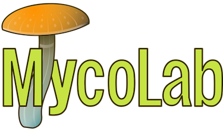
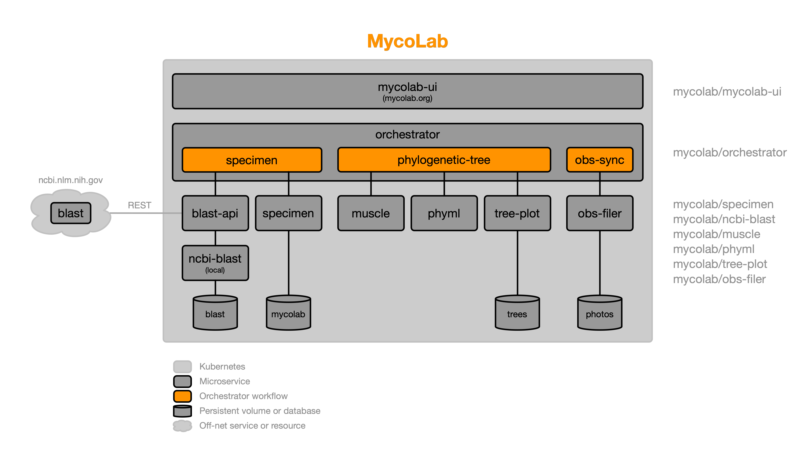

  

Suite of mycology applications and tools for automating common lab workflows.

- Website: https://mycolab.org
- Email: <info@mycolab.org>
- Github: https://github.com/mycolab
- Discord: https://discord.gg/STW6wXaNBC

## Features

- Query BLAST
- Curate FASTA files
- Generate phylogenetic trees
- Periodic tree updates
- Publish results to various sites: inaturalist.org, mushroomobserver.org, etc.

## Architecture
